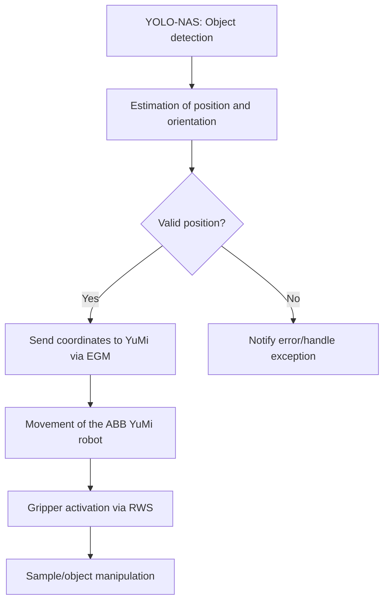

# Ciencia-de-datos

Este repositorio contendrá las actualizaciones de nuestra interfaz

# Illustrated Guide: Resolving "Battery Backup Lost" (38200) on ABB YuMi IRB 14000

This illustrated guide provides step-by-step instructions to resolve the “Battery Backup lost” (38200) error on the ABB YuMi IRB 14000 robot, particularly after replacing the SMB battery and following standard reset procedures. The guide summarizes best practices from ABB manuals and user forums.

---

## 1. **Safety First!**

- **Always power off** the robot and controller before opening any covers or handling internal components.
- Use ESD protection (anti-static wristband) if possible.
- Ensure you have the correct replacement battery (consult your robot’s manual or ABB support).

---

## 2. **Locate and Check the SMB Battery**

**A. Locate the Serial Measurement Board (SMB) Compartment**

- The SMB is typically housed in the robot’s base or upper arm joint.
- For the YuMi IRB 14000, refer to the following diagram for battery compartment location:

*Note: Location may vary slightly by revision. Check the ABB hardware manual for your specific model.*

---

**B. Open the Battery Compartment**

- Use the appropriate tool (usually a Torx or Phillips screwdriver).
- Gently open the compartment cover.

---

## 3. **Verify and Replace the Battery**

- Confirm the battery model matches ABB’s specification (usually 3.6V, non-rechargeable lithium).
- Check the battery connector for bent pins or debris.
- Insert the battery firmly; ensure the connector “clicks” into place.

---

## 4. **Hard Reset of SMB Flags (if error persists)**

**A. Disconnect the SMB**

- With the robot powered off, carefully disconnect the SMB connector (not just the battery, but the SMB’s main cable) for **20 seconds**.

- Reconnect the cable securely.

---

## 5. **Power Up and Initial Charge**

- Power up the robot and controller.
- Leave powered **ON for at least 12 hours** (recommended by ABB and user forums) to allow the SMB to recognize the new battery and reset the backup flags.

---

## 6. **Check for Errors**

- Observe the FlexPendant or RobotStudio for the 38200 error.
- If the error is gone, proceed to normal operation.
- If you see “Revolution counter not updated” (20032), go to the next step.

---

## 7. **Update Revolution Counter (if necessary)**

**A. On the FlexPendant:**

- Navigate to:  
  `Menu` → `Motors On/Off` → `Update Revolution Counter`

- Follow on-screen instructions for each affected axis.

---

## 8. **Final Steps**

- If errors persist after all steps, reload a clean system image (not just a backup) to force hardware re-detection.
- If the problem remains, the SMB itself may be faulty—contact ABB support for diagnosis or replacement.

---

## 9. **References & Additional Resources**

- [ABB IRB 14000 User Manual](https://library.e.abb.com/public/4926ac0f670a4c20918cb68641d4defa/3HAC027400%20PM%20IRB%20140-en.pdf)
- [Robot-Forum thread: IRB 14000 Yumi Battery Backup lost](https://www.robot-forum.com/robotforum/thread/31522-irb-14000-yumi-battery-backup-lost/)
- [ABB Robotics User Forums](https://forums.robotstudio.com/discussion/10167/smb-battery)

---

**If you need help locating your specific battery compartment or step-by-step video assistance, contact ABB technical support or your local distributor.**
