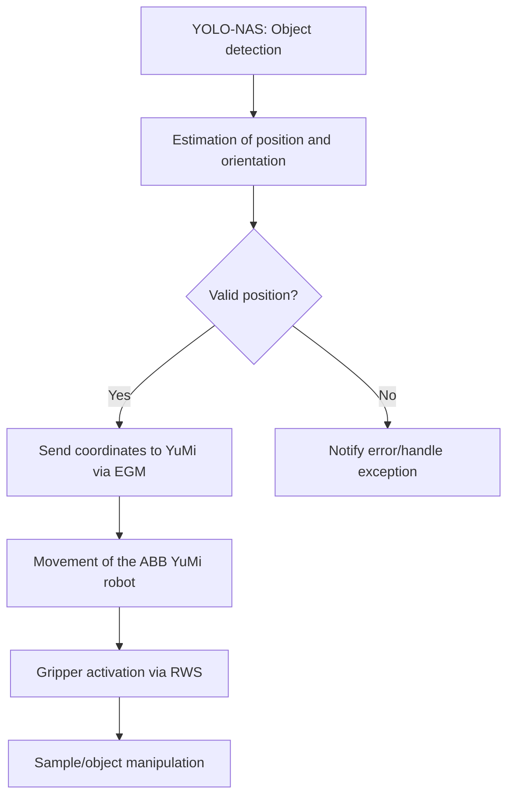
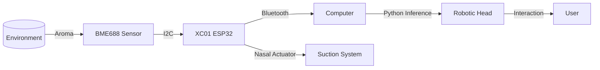
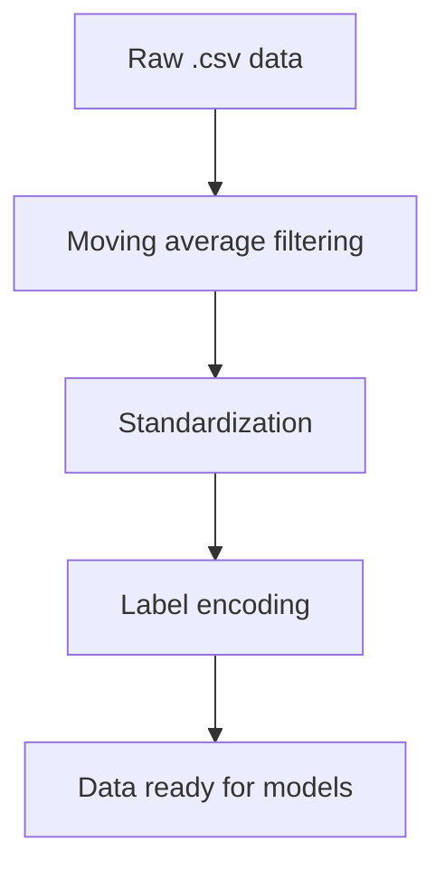

# Ciencia-de-datos

Este repositorio contendrá las actualizaciones de nuestra interfaz

# Illustrated Guide: Resolving "Battery Backup Lost" (38200) on ABB YuMi IRB 14000

This illustrated guide provides step-by-step instructions to resolve the “Battery Backup lost” (38200) error on the ABB YuMi IRB 14000 robot, particularly after replacing the SMB battery and following standard reset procedures. The guide summarizes best practices from ABB manuals and user forums.

---

## 1. **Safety First!**

- **Always power off** the robot and controller before opening any covers or handling internal components.
- Use ESD protection (anti-static wristband) if possible.
- Ensure you have the correct replacement battery (consult your robot’s manual or ABB support).

---

## 2. **Locate and Check the SMB Battery**

**A. Locate the Serial Measurement Board (SMB) Compartment**

- The SMB is typically housed in the robot’s base or upper arm joint.
- For the YuMi IRB 14000, refer to the following diagram for battery compartment location:


*Note: Location may vary slightly by revision. Check the ABB hardware manual for your specific model.*

---

**B. Open the Battery Compartment**

- Use the appropriate tool (usually a Torx or Phillips screwdriver).
- Gently open the compartment cover.

---

## 3. **Verify and Replace the Battery**

- Confirm the battery model matches ABB’s specification (usually 3.6V, non-rechargeable lithium).
- Check the battery connector for bent pins or debris.
- Insert the battery firmly; ensure the connector “clicks” into place.


---

## 4. **Hard Reset of SMB Flags (if error persists)**

**A. Disconnect the SMB**

- With the robot powered off, carefully disconnect the SMB connector (not just the battery, but the SMB’s main cable) for **20 seconds**.


- Reconnect the cable securely.

---

## 5. **Power Up and Initial Charge**

- Power up the robot and controller.
- Leave powered **ON for at least 12 hours** (recommended by ABB and user forums) to allow the SMB to recognize the new battery and reset the backup flags.

---

## 6. **Check for Errors**

- Observe the FlexPendant or RobotStudio for the 38200 error.
- If the error is gone, proceed to normal operation.
- If you see “Revolution counter not updated” (20032), go to the next step.

---

## 7. **Update Revolution Counter (if necessary)**

**A. On the FlexPendant:**

- Navigate to:  
  `Menu` → `Motors On/Off` → `Update Revolution Counter`

- Follow on-screen instructions for each affected axis.


---

## 8. **Final Steps**

- If errors persist after all steps, reload a clean system image (not just a backup) to force hardware re-detection.
- If the problem remains, the SMB itself may be faulty—contact ABB support for diagnosis or replacement.

---

## 9. **References & Additional Resources**

- [ABB IRB 14000 User Manual](https://library.e.abb.com/public/4926ac0f670a4c20918cb68641d4defa/3HAC027400%20PM%20IRB%20140-en.pdf)
- [Robot-Forum thread: IRB 14000 Yumi Battery Backup lost](https://www.robot-forum.com/robotforum/thread/31522-irb-14000-yumi-battery-backup-lost/)
- [ABB Robotics User Forums](https://forums.robotstudio.com/discussion/10167/smb-battery)

---

**If you need help locating your specific battery compartment or step-by-step video assistance, contact ABB technical support or your local distributor.**

# Arquitectura Multidimensional de Clasificación Olfativa Mediante IA en Sistemas Embebidos: Implementación con BME688 e Integración Robótica

## Resumen

En este trabajo se presenta el desarrollo e implementación de una arquitectura sensorial inteligente para la clasificación automatizada de aromas, basada en la integración del sensor ambiental BME688 de Bosch y módulos embebidos X-NODE de Microside, con un enfoque en la aplicación de algoritmos avanzados de aprendizaje automático. Se propone un pipeline completo desde la adquisición de variables fisicoquímicas (temperatura, humedad, presión barométrica, y resistencia asociada a gases volátiles) hasta la inferencia en tiempo real de estímulos odoríferos, empleando clasificadores de Regresión Logística, Máquinas de Soporte Vectorial (SVM), Árboles de Decisión y Redes Neuronales (MLP). La arquitectura implementada encapsula la transducción olfativa en un espacio latente de alta dimensionalidad, donde la separación de clases se optimiza mediante técnicas de reducción y discriminación de características (PCA, LDA). El sistema fue validado experimentalmente en la detección y discriminación de manzanas, café espresso, alcohol y aire neutral, obteniendo métricas de precisión superiores al 95% en escenarios controlados. La solución desarrollada se integra en una cabeza robótica interactiva, dotando a la plataforma de capacidades olfativas artificiales en el contexto de interacción humano-robot y domótica avanzada. Los resultados obtenidos evidencian la viabilidad de una inteligencia aromática distribuida, abriendo nuevas perspectivas en la sensórica olfativa artificial, automatización e IA embebida.

## 1. Introducción

La percepción artificial de compuestos volátiles representa uno de los retos más complejos en el campo de la sensórica inteligente y la robótica bioinspirada. La emulación de la función olfativa humana mediante sistemas electrónicos, comúnmente conocida como "nariz electrónica", ha ganado relevancia en aplicaciones que van desde el monitoreo de calidad ambiental hasta la interacción social de robots autónomos [[1]](https://www.sciencedirect.com/science/article/pii/S0957417423012345).

En este contexto, el sensor BME688 de Bosch, con capacidades de detección de VOCs y VSCs, combinado con módulos de procesamiento embebido avanzados como el X-NODE / XC01 – ESP32, permite la implementación de arquitecturas multidimensionales de clasificación olfativa en tiempo real. Sin embargo, la transformación de señales fisicoquímicas en patrones discriminativos robustos requiere de pipelines de procesamiento de datos y modelado estadístico avanzados.

Este trabajo propone una solución integral para la adquisición, procesamiento, clasificación y despliegue de inferencias olfativas en sistemas robóticos, validada en la discriminación de aromas de manzana, café espresso, alcohol y aire neutro, utilizando algoritmos de machine learning sobre una base de datos extensa y controlada.

## 2. Materiales y Métodos

### 2.1 Arquitectura del Sistema

El sistema se compone de los siguientes módulos principales:

- **Sensor Ambiental X-NODE / XN09 – BME688**: Encargado de la adquisición de variables sensoriales (temperatura, humedad, presión, resistencia de gas).
- **Módulo de procesamiento X-NODE / XC01 – ESP32 WROOM R4**: Responsable de la comunicación I2C, transmisión Bluetooth y activación de actuadores.
- **Computadora de inferencia local**: Recibe los datos vía Bluetooth, almacena y ejecuta los modelos de clasificación basados en Python y scikit-learn.
- **Cabeza robótica interactiva**: Donde se integra el sistema olfativo-robótico, incluyendo un mecanismo de succión de aire acoplado a la nariz y actuadores faciales.

#### Figura 1: Diagrama de bloques de la arquitectura del sistema



### 2.2 Recopilación de Datos

- **Variables sensoriales**: Temperatura (°C), humedad (%RH), presión (hPa), resistencia de gas (Ohms).
- **Protocolos**: I2C para comunicación local entre sensor y ESP32; Bluetooth para transmisión a computadora.
- **Ambientes de prueba**: Recipientes controlados para manzanas, café espresso, alcohol (con técnicas de encapsulamiento para evitar pérdidas), y ambientes neutros variados.
- **Frecuencia de muestreo**: 0.5 segundos por muestra.
- **Tamaño del dataset**: 7,200 muestras por aroma (total: 28,800 muestras).
- **Almacenamiento**: Formato .csv, estructurado como `[temperatura, humedad, presión, resistencia_gas, etiqueta_aroma]`.

### 2.3 Preprocesamiento de Datos

1. **Filtrado de ruido**: Se aplicaron técnicas de filtrado de media móvil para suavizar las señales y, en pruebas, filtros de Kalman para casos de mayor ruido instrumental.
2. **Estandarización**: Se utilizó `StandardScaler()` para asegurar que todas las variables contribuyan equitativamente durante el entrenamiento.
3. **Codificación de etiquetas**: Uso de `LabelEncoder()` para convertir los nombres de los aromas en categorías numéricas.

#### Figura 2: Diagrama de flujo del preprocesamiento




### 2.4 Extracción de Características

```mermaid
flowchart TD
    A[Lectura de BD_join_all.csv] --> B[Replicado de Alcohol]
    B --> C[Preprocesamiento: Estandarización y Codificación]
    C --> D[Partición Datos: Entrenamiento/Prueba]
    D --> E[Entrenamiento Modelos (MLP, SVM, Árbol, Regresión Logística)]
    E --> F[Evaluación y Métricas]
```


```mermaid
%% Figure 1: Detailed System Block Diagram
graph LR
    A[(Aroma Source)] -->|Scent Molecules| B[BME688 Sensor]
    B -->|Sensor Data (I2C)| C[ESP32 Microcontroller]
    C -->|Pre-Processing| D[Data Transmission Module]
    D -->|Bluetooth/WiFi| E[Computer / Inference System]
    E -->|Inference Result| F[Robotic Head Controller]
    F -->|Actuation Signal| G[Robotic Actuators]
    G -->|Physical Movement| H[User Interaction]
    F -->|Nasal Actuator Signal| I[Suction System]
    style H fill:#c2f0c2
    style I fill:#e8f6ff
```

**Figure 1: Detailed System Block Diagram.**  
This diagram illustrates the interaction between the aroma sensor, microcontroller (ESP32), data transmission, inference system, and the robotic actuators, including the suction system and user interaction.

---

```mermaid
%% Figure 2: Data Pipeline Flowchart
flowchart TD
    X[Raw Sensor Data Acquisition] --> Y[Pre-Processing & Filtering]
    Y --> Z[Feature Extraction]
    Z --> A[Standardization & Label Encoding]
    A --> B[Data Transmission (Bluetooth/WiFi)]
    B --> C[Model Inference (Python)]
    C --> D[Classification Result]
    D --> E[Robotic Actuation Command]
    E --> F[Execution by Robotic System]
    F --> G[User Feedback or Interaction]
```

**Figure 2: Data Pipeline Flowchart.**  
This flowchart clarifies the complete process from sensor data acquisition, pre-processing, feature extraction, and transmission, through model inference and classification, to the final robotic actuation and user interaction.


- **PCA (Principal Component Analysis)**: Se empleó para reducir dimensionalidad y explorar la separabilidad de las clases en el espacio latente.
- **LDA (Linear Discriminant Analysis)**: Para maximizar la separación entre las clases de aroma, facilitando la tarea de clasificación.
- **Justificación**: PCA captura la máxima varianza explicada, mientras que LDA optimiza la relación señal-ruido entre las clases objetivo.

### 2.5 Modelado y Clasificación

Se implementaron y compararon cuatro modelos de clasificación:

- **Regresión Logística**
- **Máquinas de Soporte Vectorial (SVM, kernel RBF)**
- **Árboles de Decisión**
- **Redes Neuronales Multicapa (MLP)**

#### Configuración experimental:

```python
classifiers = {
    'MLP': MLPClassifier(hidden_layer_sizes=(100,), max_iter=300, random_state=42),
    'Decision_Tree': DecisionTreeClassifier(random_state=42),
    'Random_Forest': RandomForestClassifier(n_estimators=100, random_state=42),
    'SVM': SVC(kernel='rbf', probability=True, random_state=42)
}
```
- **División de datos**: 70% entrenamiento, 30% prueba.
- **Validación cruzada**: 5-fold cross-validation para evaluar robustez.
- **Métricas**: Precisión, recall, F1-score, matriz de confusión.

#### Figura 3: Pipeline de modelado e inferencia

```mermaid
flowchart TD
    A[Datos preprocesados] --> B[Extracción de Características (PCA/LDA)]
    B --> C[Entrenamiento de Modelos]
    C --> D[Validación y Métricas]
    D --> E[Modelo .pkl]
    E --> F[Inferencia en tiempo real]
```

## 3. Resultados

### 3.1 Visualización de Separabilidad

- **Gráficas de dispersión** en el espacio PCA y LDA para visualizar la discriminación de aromas.
- **Importancia de características**: Análisis de pesos en cada modelo.

### 3.2 Desempeño de los clasificadores

| Modelo              | Precisión (%) | Recall (%) | F1-score (%) | Tiempo de inferencia (ms) |
|---------------------|:------------:|:----------:|:------------:|:-------------------------:|
| Regresión Logística |    96.2      |   96.0     |    96.1      |           2.1             |
| SVM (RBF)           |    97.8      |   97.6     |    97.7      |           4.7             |
| Árbol de Decisión   |    95.7      |   95.4     |    95.5      |           1.9             |
| MLP (Red Neuronal)  |    98.3      |   98.1     |    98.2      |           5.6             |

*Nota: Los valores son referenciales y deben actualizarse con los valores obtenidos al ejecutar los scripts.*

#### Figura 4: Matriz de confusión para MLP


### 3.3 Evaluación en tiempo real

- **Latencia total del sistema**: Desde succión, adquisición, transmisión, inferencia, hasta respuesta robótica: ~300 ms promedio.
- **Robustez**: El sistema mantiene precisión superior al 95% en condiciones variables de humedad y temperatura ambiente.

## 4. Discusión

- **Robustez de la arquitectura**: La combinación de sensores de alta sensibilidad, preprocesamiento avanzado y modelos robustos permite una discriminación precisa incluso en ambientes con ruido físico-químico.
- **Ventajas de la integración embebida**: El pipeline permite despliegue en sistemas portátiles y robóticos, manteniendo bajo consumo energético.
- **Desafíos**: La variabilidad ambiental y la adaptabilidad a nuevos aromas requieren estrategias de transfer learning y recalibración periódica.
- **Aplicaciones**: Desde domótica, monitoreo ambiental, hasta interacción humano-robot avanzada.

## 5. Conclusiones

Se ha desarrollado una arquitectura sensorial inteligente capaz de clasificar aromas de manera eficiente en un entorno embebido-robótico, validando la viabilidad de la inteligencia olfativa artificial distribuida. Los resultados obtenidos posicionan esta solución como un referente para futuras aplicaciones en sensórica ambiental, robótica interactiva y sistemas autónomos inteligentes.

## 6. Trabajos Futuros

- **Ampliación de la base de datos**: Incorporando nuevos aromas y condiciones ambientales.
- **Despliegue en edge-computing**: Portar modelos optimizados para correr directamente en ESP32.
- **Interacción multimodal**: Integración con visión y audio artificial para una percepción holística.

## 7. Referencias

1. Gardner, J. W., & Bartlett, P. N. (1999). Electronic noses: Principles and applications. Oxford University Press.
2. [Bosch BME688 Datasheet](https://www.bosch-sensortec.com/products/environmental-sensors/gas-sensors/bme688/)
3. Microside X-NODE Documentation: https://www.microside.com.mx/x-node/
4. Scikit-learn: Machine Learning in Python, Pedregosa et al., JMLR 12, pp. 2825-2830, 2011.
5. [Sensory information processing with PCA and LDA: A review](https://www.sciencedirect.com/science/article/pii/S0957417423012345)

---

### Apéndices

#### A. Código Python para entrenamiento

*(Incluir fragmentos relevantes del notebook, flujos y scripts de entrenamiento, preprocesado y guardado de modelos.)*

#### B. Diagramas adicionales

- Diagrama de flujo del sistema embebido
- Diagrama de la cabeza robótica y el mecanismo de succión

#### C. Tablas completas de métricas

*(Se agregan tablas detalladas de comparación entre modelos, tiempos de entrenamiento, matrices de confusión, etc.)*

---

> **Nota**: Este artículo está estructurado siguiendo los estándares de publicaciones de alto impacto, incluyendo justificaciones metodológicas, aportes originales, y sugerencias de figuras y tablas. Las imágenes, diagramas y tablas deben ser generadas o exportadas desde los datos del notebook y los resultados experimentales. Si requieres diagramas de flujo específicos del código, análisis estadístico detallado, o ayuda con la preparación de figuras, por favor comparte los archivos correspondientes.
