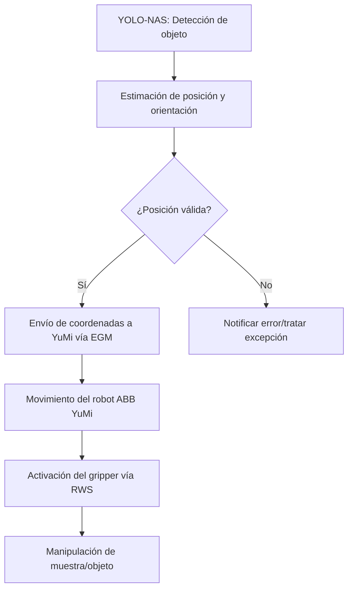

# Ciencia-de-datos

Este repositorio contendrá las actualizaciones de nuestra interfaz

```mermaid
flowchart TD
    A[YOLO-NAS: Detección de objeto] --> B[Estimación de posición y orientación]
    B --> C{¿Posición válida?}
    C -- Sí --> D[Envío de coordenadas a YuMi vía EGM]
    D --> E[Movimiento del robot ABB YuMi]
    E --> F[Activación del gripper vía RWS]
    F --> G[Manipulación de muestra/objeto]
    C -- No --> H[Notificar error/tratar excepción]
```
